# Tik Architecture V2

## 1. 这份文档的定位

这不是一份脱离现状的理想稿，而是一份：

- 以你原始 `archv2` 为目标架构
- 对照当前 Tik 真实实现
- 标明已经完成的升级
- 标明仍然值得继续推进的剩余缺口

一句话总结：

> Tik 已经从“provider glue + CLI phase 拼接”升级为“workspace control plane + workflow engine + event/read model”，这份文档记录的是当前已验证状态，而不是愿景草图。

---

## 2. 目标架构摘要

你原始 `archv2` 的核心判断可以收成四句：

1. Tik 应该是 control plane，不是 Codex 的壳。
2. Workflow 应该是内部 contract，不是产品表面。
3. Multi-agent 应该是运行时策略，不是产品本体。
4. Context / memory / execution 应该围绕“最小高信号 + 可治理状态”组织。

因此目标形态是：

```text
User Surface
  -> Control Plane
  -> Workflow Engine
  -> Context / Memory / Evidence
  -> Runtime / Harness
  -> Provider Backends
```

在这个目标里：

- Tik 拥有 task lifecycle / workspace lifecycle / policy / event truth / read model
- Codex 是 execution substrate
- skill 是 workflow contract 的运行时载体
- agent 与 subagent 是 runtime primitive

---

## 3. 当前实现快照

当前 Tik 已经不再是单纯的 CLI + provider glue，已经具备可运行的 workspace control plane、workflow engine、event projection、memory 和 public read model。

### 3.1 已存在的层

#### User Surface

- CLI workspace commands  
  见 [index.ts](/Users/huyuehui/ace/tik/packages/cli/src/index.ts)
- Dashboard API client  
  见 [client.ts](/Users/huyuehui/ace/tik/packages/dashboard/src/api/client.ts)

#### Control Plane

- workspace bootstrap / state / split demand / feedback / retry / phase 推进  
  见 [workspace-orchestrator.ts](/Users/huyuehui/ace/tik/packages/kernel/src/workspace-orchestrator.ts)
- workspace-managed execution isolation / effective path 切换  
  见 [workspace-worktree-manager.ts](/Users/huyuehui/ace/tik/packages/kernel/src/workspace-worktree-manager.ts)

#### Workflow Engine

- phase orchestration / executor dispatch / projection refresh / memory refresh  
  见 [workspace-workflow-engine.ts](/Users/huyuehui/ace/tik/packages/kernel/src/workspace-workflow-engine.ts)
- phase executors  
  见 [workspace-phase-executors.ts](/Users/huyuehui/ace/tik/packages/kernel/src/workspace-phase-executors.ts)
- first-class workflow spec  
  见 [workspace-workflow-spec.ts](/Users/huyuehui/ace/tik/packages/kernel/src/workspace-workflow-spec.ts)

#### Context / Contract / Evidence

- context assembler  
  见 [workspace-context-assembler.ts](/Users/huyuehui/ace/tik/packages/kernel/src/workspace-context-assembler.ts)
- execution contract synthesizer  
  见 [workspace-execution-contract-synthesizer.ts](/Users/huyuehui/ace/tik/packages/kernel/src/workspace-execution-contract-synthesizer.ts)
- completion evidence  
  见 [workspace-completion-evidence.ts](/Users/huyuehui/ace/tik/packages/kernel/src/workspace-completion-evidence.ts)
- policy engine  
  见 [workspace-policy-engine.ts](/Users/huyuehui/ace/tik/packages/kernel/src/workspace-policy-engine.ts)

#### Runtime / Harness

- `WorkflowSubtaskRuntime`
- `WorkflowSubtaskSupervisor`
- provider event forwarding
- delegated / governed provider 切换  
  见 [subtask-runtime.ts](/Users/huyuehui/ace/tik/packages/kernel/src/subtask-runtime.ts)  
  见 [subtask-supervisor.ts](/Users/huyuehui/ace/tik/packages/kernel/src/subtask-supervisor.ts)

#### Event / Memory / Read Model

- workspace event store  
  见 [workspace-event-store.ts](/Users/huyuehui/ace/tik/packages/kernel/src/workspace-event-store.ts)
- event projection  
  见 [workspace-event-projection.ts](/Users/huyuehui/ace/tik/packages/kernel/src/workspace-event-projection.ts)
- session / project memory  
  见 [workspace-memory.ts](/Users/huyuehui/ace/tik/packages/kernel/src/workspace-memory.ts)
- public read model  
  见 [workspace-public-api.ts](/Users/huyuehui/ace/tik/packages/kernel/src/workspace-public-api.ts)
- non-CLI HTTP read routes  
  见 [server.ts](/Users/huyuehui/ace/tik/packages/kernel/src/server.ts)
- versioned read surface  
  见 [workspace-public-api.ts](/Users/huyuehui/ace/tik/packages/kernel/src/workspace-public-api.ts)  
  见 [server.ts](/Users/huyuehui/ace/tik/packages/kernel/src/server.ts)

#### Artifact Layer

- feature-local artifact resolution
- deterministic target path pinning
- native artifact rescue
- workspace doc materialization  
  见 [workspace-artifacts.ts](/Users/huyuehui/ace/tik/packages/cli/src/workspace-artifacts.ts)  
  见 [workspace-skill-executors.ts](/Users/huyuehui/ace/tik/packages/kernel/src/workspace-skill-executors.ts)

#### Execution Isolation

- `sourceProjectPath / effectiveProjectPath` 分层
- worktree policy 已成为 workspace settings 的一部分
- `worktreeLanes` 已进入 workspace state，用于保留多 lane 的受管状态
- phase 开始前统一确保 execution path ready
- CLI 已提供 `worktree list/status/path/create/use/remove` 管理面
- 非 git 项目默认支持 `source` 策略，也支持 `copy` 隔离策略
- dashboard 和 HTTP API 已具备 lane 级 create/use/remove 管理面
  见 [workspace-worktree-manager.ts](/Users/huyuehui/ace/tik/packages/kernel/src/workspace-worktree-manager.ts)  
  见 [index.ts](/Users/huyuehui/ace/tik/packages/cli/src/index.ts)

### 3.2 已经完成的关键升级

这一轮及前一轮已经完成的关键升级：

1. 去掉 `projectKind` 静态 docs/code 分流
2. 去掉 silent fallback/template success
3. workspace artifacts 改成 deterministic feature-local path
4. `specify / plan` 支持 native rescue
5. workspace 产物和 `.workspace` 状态分层清晰
6. installed skill source (`~/.agents/skills`) 已接入
7. phase 结果展示稳定显示 `mode=native`
8. `WorkflowEngine` 已从 CLI helper 下沉到 kernel
9. workflow spec 已成为 first-class 数据模型
10. `ExecutionContractSynthesizer` 已从 hardcode 走到泛化初版
11. `CompletionEvidence` 已成为独立模块
12. `WorkspacePolicyEngine` 已支持 profile 化配置
13. `workspace policy --workflow-profile ...` 已支持 bootstrap 后动态切换 profile
14. workspace event store + projection 已持久化并可投影
15. `WorkspaceMemoryStore` 已提供 session / project memory
16. `WorkspaceReadModel` 已提供带 `apiVersion/schemaVersion` 的稳定读取面
17. server 已暴露带版本 header 的 `/api/workspace/status|board|report|memory`
18. `WorkspaceEventProjection` 已同时提供 raw recent 与 denoised `recentDisplay`
19. `CompletionEvidence` 已可识别 `test/*.test.js` 等非 Java 测试工件
20. `ExecutionContractSynthesizer` 已提供 confidence / ranked candidates / signals
21. workspace-managed worktree execution isolation 已接入主链
22. `sourceProjectPath / effectiveProjectPath` 已成为 workspace state 一等字段
23. `specify / plan / ace` 已统一使用 execution path，而不是直接写源工作区
24. `tik worktree list/status/path/create/use/remove` 已提供可见管理面

### 3.3 已验证的运行证据

这一版不是“只在代码层看起来成立”，而是已经通过真实 workspace 跑通。

第一轮真实 workspace：

- workspace root: [workspace-archv2-e2e-r1](/Users/huyuehui/ace/.tmp/workspace-archv2-e2e-r1)
- project repo: [demo-service](/Users/huyuehui/ace/.tmp/workspace-archv2-e2e-r1/demo-service)
- final state: [state.json](/Users/huyuehui/ace/.tmp/workspace-archv2-e2e-r1/.workspace/state.json)
- event log: [events.jsonl](/Users/huyuehui/ace/.tmp/workspace-archv2-e2e-r1/.workspace/events.jsonl)
- generated spec: [spec.md](/Users/huyuehui/ace/.tmp/workspace-archv2-e2e-r1/demo-service/.specify/specs/demo-service-demo-service-src-greet-js-greet/spec.md)
- generated plan: [plan.md](/Users/huyuehui/ace/.tmp/workspace-archv2-e2e-r1/demo-service/.specify/specs/demo-service-demo-service-src-greet-js-greet/plan.md)

第二轮真实 workspace：

- workspace root: [workspace-archv2-e2e-r2](/Users/huyuehui/ace/.tmp/workspace-archv2-e2e-r2)
- final state: [state.json](/Users/huyuehui/ace/.tmp/workspace-archv2-e2e-r2/.workspace/state.json)
- event log: [events.jsonl](/Users/huyuehui/ace/.tmp/workspace-archv2-e2e-r2/.workspace/events.jsonl)
- session memory: [session.json](/Users/huyuehui/ace/.tmp/workspace-archv2-e2e-r2/.workspace/memory/session.json)
- project memory: [demo-service.json](/Users/huyuehui/ace/.tmp/workspace-archv2-e2e-r2/.workspace/memory/projects/demo-service.json)
- generated spec: [spec.md](/Users/huyuehui/ace/.tmp/workspace-archv2-e2e-r2/demo-service/.specify/specs/demo-service-demo-service-src-greet-js-greet/spec.md)
- generated plan: [plan.md](/Users/huyuehui/ace/.tmp/workspace-archv2-e2e-r2/demo-service/.specify/specs/demo-service-demo-service-src-greet-js-greet/plan.md)

真实运行链路已经验证了：

1. `workspace run -> workspace next` 能完整走完 `PARALLEL_CLARIFY -> PARALLEL_SPECIFY -> PARALLEL_PLAN -> PARALLEL_ACE`
2. `specify / plan / ace` 都能以 `native` 完成
3. `status / board / report` 已直接消费 event projection 与 policy 配置
4. `memory/session.json` 与 `memory/projects/*.json` 已在真实 workspace 中生成
5. 非 CLI consumer 可通过 `WorkspaceReadModel` 与 server read routes 直接读取 workspace 状态
6. 真实代码改动与 `npm test` 已在项目仓库中通过验证

第三轮真实 workspace（execution isolation / worktree）：

- multi-lane workspace root: [worktree-multilane-e2e](/Users/huyuehui/ace/.tmp/worktree-multilane-e2e)
- multi-lane state snapshot: [state.json](/Users/huyuehui/ace/.tmp/worktree-multilane-e2e/.workspace/state.json)
- non-git workspace root: [worktree-nongit-e2e](/Users/huyuehui/ace/.tmp/worktree-nongit-e2e)
- non-git state snapshot: [state.json](/Users/huyuehui/ace/.tmp/worktree-nongit-e2e/.workspace/state.json)
- non-git copy workspace root: [worktree-nongit-copy-e2e](/Users/huyuehui/ace/.tmp/worktree-nongit-copy-e2e)

真实运行链路额外验证了：

1. `tik worktree create --lane <id>` 会为 git 项目创建受管 lane
2. `tik worktree use --lane <id>` 会切换 active execution lane
3. workspace phase 真实产物会写入 active lane 的 execution path，而不是源工作区
4. `workspace status / board / report` 已能显示 `source / exec / worktree / worktree-branch`
5. 非 git 项目既可通过 `nonGitStrategy=source` 继续执行，也可通过 `nonGitStrategy=copy` 获得隔离 copy lane
6. `/api/workspace/worktrees` 与 dashboard lane panel 已可直接 create/use/remove lane
7. `tik worktree remove --force` 会移除隔离 worktree，但保留分支供后续 review / merge

### 3.4 三轮 review 与修复结果

这轮升级不是“写完就停”，而是额外做了 3 轮 review，并都修了真实问题。

#### Review 1

发现：

- `.workspace/memory/projects` 可能残留陈旧 project memory 文件
- dashboard build 的 chunk 策略第一次切分后仍不稳定

修复：

- `WorkspaceMemoryStore.refresh()` 会删除已不再活跃的 project memory 文件
- memory 写入改为 `writeIfChanged()`，避免无意义重写
- dashboard 只保留稳定的 `react-vendor` chunk 拆分

#### Review 2

发现：

- project name 直接映射文件名时，包含空格或 `/` 会生成不安全文件名

修复：

- project memory 文件名改为安全 sanitize 规则
- 已补测试验证 `catalog suite/api -> catalog-suite-api.json`

#### Review 3

发现：

- `WorkspaceReadModel.load()` 在没有 workspace 状态时也会创建 `.workspace/memory`

修复：

- 无状态 root 现在返回内存中的空 snapshot
- 仅当真实 workspace state / events 存在时才刷新磁盘 memory

### 3.5 当前执行流程图

当前真实主路径已经不是“CLI 临时拼接 prompt”，而是：

`workspace state 编排 -> execution isolation -> kernel workflow engine -> phase executor -> delegated skill 执行 -> artifact/contract 证据收口 -> native completed`

```mermaid
flowchart TD
    A["用户执行 `tik workspace run --demand ...`"] --> B["WorkspaceResolver 解析 `.code-workspace`"]
    B --> C["WorkspaceOrchestrator.bootstrap<br/>写入 `.workspace/settings.json` / `state.json` / `split-demands.json`"]
    C --> D["进入 `PARALLEL_CLARIFY`"]

    D --> E["CLI `workspace next`"]
    E --> F["WorkspaceWorkflowEngine.runPhase"]
    F --> G["WorkspaceWorktreeManager.ensureExecutionTarget<br/>固定 source path / effective path"]
    G --> H["WorkspaceClarifyPhaseExecutor"]

    H --> I["WorkspaceSuperpowersClarifier<br/>综合 demand / contract / memory / artifacts"]
    I --> J{"需要人工澄清?"}
    J -- "是" --> K["写入 `.workspace/clarifications/<project>/clarify-<n>.md`<br/>生成 structured decision"]
    K --> Z["进入 `FEEDBACK_ITERATION`"]
    J -- "否" --> L["orchestrator.markClarifyResult<br/>执行模式记为 `native`"]

    L --> M["自动推进到 `PARALLEL_SPECIFY`"]
    M --> N["WorkspaceSpecifyPhaseExecutor"]

    N --> O["WorkspaceContextAssembler.buildSpecifySubtaskSpec<br/>固定 target spec path"]
    O --> P["materializeWorkflowSkillDelegatedSpec<br/>绑定 `~/.agents/skills` 中的 `sdd-specify` skill"]
    P --> Q["WorkflowSubtaskRuntime + Supervisor<br/>启动 delegated Codex 子任务"]

    Q --> R{"feature-local `spec.md` 是否产出?"}
    R -- "是" --> S["orchestrator.markSpecifyResult<br/>执行模式记为 `native`"]
    R -- "否，但策略允许 native rescue" --> T["runNativeWorkspaceArtifactRescue"]
    T --> U{"救援后产物存在?"}
    U -- "是" --> S
    U -- "否" --> V["markProjectBlocked + recordFeedback"]

    S --> W["自动推进到 `PARALLEL_PLAN`"]
    V --> Z

    W --> X["WorkspacePlanPhaseExecutor"]
    X --> Y["ContextAssembler.buildPlanSubtaskSpec<br/>沿用同一 feature dir"]
    Y --> ZA["delegated `sdd-plan`"]
    ZA --> ZB{"valid `plan.md` 是否产出?"}
    ZB -- "是" --> ZC["markPlanResult<br/>执行模式记为 `native`"]
    ZB -- "否，但策略允许 native rescue" --> ZD["runNativeWorkspaceArtifactRescue"]
    ZD --> ZE{"救援后 plan 有效?"}
    ZE -- "是" --> ZC
    ZE -- "否" --> V

    ZC --> ZF["自动推进到 `PARALLEL_ACE`"]

    ZF --> ZG["WorkspaceAcePhaseExecutor"]
    ZG --> ZH["WorkspaceContextAssembler.buildAceSubtaskSpec"]
    ZH --> ZI["ExecutionContractSynthesizer<br/>生成 execution-ready contract"]
    ZI --> ZJ{"本地 git 改动是否已满足 contract?"}
    ZJ -- "是" --> ZK["collectCompletionEvidence + summarizeCompletionEvidence<br/>直接 promote 为 `completed (mode=native)`"]
    ZJ -- "否" --> ZL["delegated `ace-sdd-workflow`"]

    ZL --> ZM{"ACE 正常完成?"}
    ZM -- "是" --> ZN["markAceResult completed"]
    ZM -- "超时" --> ZO["captureGitChangedFiles + collectCompletionEvidence"]
    ZO --> ZP{"超时后证据满足 contract?"}
    ZP -- "是" --> ZK
    ZP -- "否" --> V

    ZK --> ZQ["Workspace currentPhase = `COMPLETED`"]
    ZN --> ZQ
```



对应代码映射：

- 编排入口见 [index.ts](/Users/huyuehui/ace/tik/packages/cli/src/index.ts)
- 工作流引擎见 [workspace-workflow-engine.ts](/Users/huyuehui/ace/tik/packages/kernel/src/workspace-workflow-engine.ts)
- workflow spec 见 [workspace-workflow-spec.ts](/Users/huyuehui/ace/tik/packages/kernel/src/workspace-workflow-spec.ts)
- phase executor 见 [workspace-phase-executors.ts](/Users/huyuehui/ace/tik/packages/kernel/src/workspace-phase-executors.ts)
- context 组装见 [workspace-context-assembler.ts](/Users/huyuehui/ace/tik/packages/kernel/src/workspace-context-assembler.ts)
- ACE contract 合成见 [workspace-execution-contract-synthesizer.ts](/Users/huyuehui/ace/tik/packages/kernel/src/workspace-execution-contract-synthesizer.ts)
- completion evidence 见 [workspace-completion-evidence.ts](/Users/huyuehui/ace/tik/packages/kernel/src/workspace-completion-evidence.ts)
- policy decision 见 [workspace-policy-engine.ts](/Users/huyuehui/ace/tik/packages/kernel/src/workspace-policy-engine.ts)
- memory 见 [workspace-memory.ts](/Users/huyuehui/ace/tik/packages/kernel/src/workspace-memory.ts)
- read model 见 [workspace-public-api.ts](/Users/huyuehui/ace/tik/packages/kernel/src/workspace-public-api.ts)
- non-CLI read route 见 [server.ts](/Users/huyuehui/ace/tik/packages/kernel/src/server.ts)
- artifact path / resolver 见 [workspace-artifacts.ts](/Users/huyuehui/ace/tik/packages/cli/src/workspace-artifacts.ts)
- git changed-files parsing 见 [workspace-git.ts](/Users/huyuehui/ace/tik/packages/cli/src/workspace-git.ts)

---

## 4. 架构对比：目标 vs 当前

## 4.1 Tik 是否已经是 Control Plane？

### 目标

Tik 掌握：

- task lifecycle
- workspace lifecycle
- event truth
- approvals / policy 映射
- feedback / retry / recovery
- 可被非 CLI consumer 读取的状态面

### 当前

已实现：

- workspace lifecycle
- state persistence
- feedback / retry / phase transition
- artifact-based completion truth
- workspace event store + projection
- 独立 policy engine
- 独立 read model
- server read routes

仍未完全实现：

- task API / event API 还没有独立 service 化治理
- dashboard 仍以 API client 为主，不是完整 control-plane UI
- workspace 与 task 的长期跨会话治理仍偏文件持久化

### 结论

当前状态：

- 已经是可运行的 workspace control plane
- 已经不是 CLI-only 内部对象
- 但还不是完整的服务化 control plane

---

## 4.2 Workflow 是否已经是 Internal Contract？

### 目标

Workflow 决定宏观路径，agent 决定微观执行。

### 当前

已经成立：

- workspace 用户只感知 `run / next / feedback / status / board / report`
- phase 内部是：
  - `PARALLEL_CLARIFY`
  - `PARALLEL_SPECIFY`
  - `PARALLEL_PLAN`
  - `PARALLEL_ACE`
- completion 依赖 artifact、evidence、event，而不是 prompt 本身
- workflow spec 已抽象成独立数据模型  
  见 [workspace-workflow-spec.ts](/Users/huyuehui/ace/tik/packages/kernel/src/workspace-workflow-spec.ts)
- execution isolation 已成为 workflow phase 的固定前置，而不是 CLI 偶然行为

剩余差距：

- 现在的 workflow spec 还是 TypeScript 数据模型，不是更强约束的 DSL / schema
- contract 与 skill 之间还主要靠代码约定，而不是更通用的声明式协议

### 结论

`workflow = internal contract` 这件事已经落地；剩下的是“把 contract 再稳定一层”，不是“从 0 开始做”。

---

## 4.3 Multi-agent 是否已经被降成 Runtime Primitive？

### 目标

- Tik agents 是主角色
- Codex subagents 是局部并行 primitive

### 当前

已经基本符合：

- workspace phase 已把 skill / subtask / supervisor 收成 runtime primitive
- planner / reviewer / executor 三角色已成为统一 role model
- `sdd-specify / sdd-plan / ace-sdd-workflow` 已映射到对应 role lane

仍未完全实现：

- 还没有更细粒度的 reviewer-led multi-lane control model
- 多子任务并发治理仍然偏 phase 级，而不是更通用的 task graph

### 结论

当前已经不是“multi-agent 当产品表面”，而是“multi-agent 作为 runtime primitive”；剩余差距主要在更成熟的 lane orchestration。

---

## 4.4 Context 与 Memory 是否已经 Just-in-Time？

### 目标

- bootstrap context
- execution context
- conversation context
- 大输出外存 + 小摘要进 prompt
- session / project memory 正式分层

### 当前

已经从“局部实践正确”进入了正式模块化状态：

- phase 已尽量只传 demand / target path / excerpt / execution hints
- 已有显式的 context assembler  
  见 [workspace-context-assembler.ts](/Users/huyuehui/ace/tik/packages/kernel/src/workspace-context-assembler.ts)
- 已有 session / project memory 持久层  
  见 [workspace-memory.ts](/Users/huyuehui/ace/tik/packages/kernel/src/workspace-memory.ts)
- 已有 read model 将 memory / projection / state 统一暴露  
  见 [workspace-public-api.ts](/Users/huyuehui/ace/tik/packages/kernel/src/workspace-public-api.ts)

仍未完全实现：

- memory 仍主要是 workspace 层摘要，不是更长期的知识回流体系
- 大输出外存与 preview 策略还没有独立成更强的 storage abstraction

### 结论

Context 与 Memory 的正式层已经落地；当前剩下的是“更长期、更跨会话的知识层”，不是“没有 memory”。

---

## 5. 当前最重要的结构性差距

按你原始 `archv2` 的目标看，当前 Tik 的主要差距已经从“有没有这些层”收敛成“这些层是否足够稳定、足够服务化、足够通用”。

## 5.1 WorkflowEngine 已存在，仍需更稳定的公共契约

现在已有：

- [workspace-workflow-engine.ts](/Users/huyuehui/ace/tik/packages/kernel/src/workspace-workflow-engine.ts)
- [workspace-workflow-spec.ts](/Users/huyuehui/ace/tik/packages/kernel/src/workspace-workflow-spec.ts)
- [workspace-phase-executors.ts](/Users/huyuehui/ace/tik/packages/kernel/src/workspace-phase-executors.ts)

还差：

- 更薄的 public contract
- 更明确的 versioned workflow schema
- 更稳定的外部 consumer 语义

## 5.2 Event Truth 已落地，但还缺更强的跨层 schema 与归档能力

现在已有：

- [workspace-event-store.ts](/Users/huyuehui/ace/tik/packages/kernel/src/workspace-event-store.ts)
- [workspace-event-projection.ts](/Users/huyuehui/ace/tik/packages/kernel/src/workspace-event-projection.ts)
- `status / board / report` 已直接消费 projection

还差：

- 更通用的 `TaskEvent / WorkspaceEvent` schema
- 更长期的检索 / archive / compaction 策略

## 5.3 Policy Engine 已 profile 化，但策略层仍可继续扩展

现在已有：

- [workspace-policy-engine.ts](/Users/huyuehui/ace/tik/packages/kernel/src/workspace-policy-engine.ts)
- workspace policy update surface  
  见 [index.ts](/Users/huyuehui/ace/tik/packages/cli/src/index.ts)  
  见 [workspace-orchestrator.ts](/Users/huyuehui/ace/tik/packages/kernel/src/workspace-orchestrator.ts)
- `balanced / fast-feedback / deep-verify` profile
- `workspace policy` CLI 读取与更新入口
- native rescue / timeout promote / feedback escalation

还差：

- 更细的 reroute / operator intervention policy
- 更强的 why / why-not / escalation observability

## 5.4 Execution Contract Synthesizer 已是泛化初版，但仍偏启发式

现在已有：

- [workspace-execution-contract-synthesizer.ts](/Users/huyuehui/ace/tik/packages/kernel/src/workspace-execution-contract-synthesizer.ts)
- `spec -> target extraction`
- `plan -> implementation unit extraction`
- `repo -> candidate ranking`
- `validation target synthesis`
- `confidence / rationale / candidateFiles / signals`

还差：

- 更少的 demand-family 特判
- 更广的跨语言 / 跨仓库 generic synthesis
- 更稳定的低置信度升级策略

## 5.5 Read Model 已成立，但服务化表面仍较薄

现在已有：

- [workspace-public-api.ts](/Users/huyuehui/ace/tik/packages/kernel/src/workspace-public-api.ts)
- [server.ts](/Users/huyuehui/ace/tik/packages/kernel/src/server.ts)
- [client.ts](/Users/huyuehui/ace/tik/packages/dashboard/src/api/client.ts)
- `apiVersion / schemaVersion`
- `X-Tik-Workspace-Api-Version`

还差：

- 更完整的 non-CLI dashboard surface
- 更明确的 API compatibility lifecycle / migration contract
- 更强的权限、鉴权与多 workspace consumer 设计

---

## 6. 按目标架构继续升级的路线

这里不再是“从 0 到 1”的路线，而是“从已落地初版到更稳定可复用”的路线。

## 6.1 升级一：把 WorkflowEngine 从内部实现稳定成公共契约

### 已完成

- [workspace-workflow-engine.ts](/Users/huyuehui/ace/tik/packages/kernel/src/workspace-workflow-engine.ts) 已落地
- [workspace-workflow-spec.ts](/Users/huyuehui/ace/tik/packages/kernel/src/workspace-workflow-spec.ts) 已成为 first-class spec
- `WorkspaceWorkflowEngine.runPhase()` 已返回 `events / projection / policy`
- CLI 已主要负责命令解析与展示

### 下一步

- 为 workflow spec 引入更稳定的 versioned schema
- 收薄 engine 对外 contract，减少实现细节泄漏

## 6.2 升级二：把 Recovery / Policy 升级成更清晰的用户可感知策略面

### 已完成

- `specify / plan` 的 native rescue 已接入主流程
- `ACE` 已支持 timeout 后基于 completion evidence promote to completed
- `WorkspacePolicyEngine` 已支持 `balanced / fast-feedback / deep-verify`
- `workspace status / report` 已显示 workflow profile
- `workspace policy --workflow-profile ...` 已支持 bootstrap 后切换策略档位

### 下一步

- 把 reroute / operator intervention 策略显式暴露给更上层 consumer
- 引入更细粒度的 policy observability 与 decision trace

## 6.3 升级三：继续泛化 Execution Contract Synthesizer

### 已完成

- [workspace-execution-contract-synthesizer.ts](/Users/huyuehui/ace/tik/packages/kernel/src/workspace-execution-contract-synthesizer.ts) 已落地
- 已支持从 spec / plan / repo evidence 合成 execution-ready contract
- 已输出 confidence / candidate ranking / synthesis signals

### 下一步

- 继续降低 demand-family 特判权重
- 扩大 generic synthesis 的跨语言 / 低置信度覆盖面

## 6.4 升级四：把 Completion Evidence + Event Projection 继续投影成稳定 review / dashboard model

### 已完成

- [workspace-completion-evidence.ts](/Users/huyuehui/ace/tik/packages/kernel/src/workspace-completion-evidence.ts) 已独立
- [workspace-event-projection.ts](/Users/huyuehui/ace/tik/packages/kernel/src/workspace-event-projection.ts) 已落地
- `workspace report / board` 已消费 projection 与 evidence
- projection 已提供 denoised `recentDisplay`，CLI/report 已开始使用

### 下一步

- 让 dashboard 使用更完整的 typed read model
- 把 review-friendly projections 稳定成公共输出契约

## 6.5 升级五：把 Memory / Public API 从 workspace 初版继续推向长期服务化

### 已完成

- [workspace-memory.ts](/Users/huyuehui/ace/tik/packages/kernel/src/workspace-memory.ts) 已提供 session / project memory
- [workspace-public-api.ts](/Users/huyuehui/ace/tik/packages/kernel/src/workspace-public-api.ts) 已提供 read model
- [server.ts](/Users/huyuehui/ace/tik/packages/kernel/src/server.ts) 已暴露 `/api/workspace/status|board|report|memory`
- [client.ts](/Users/huyuehui/ace/tik/packages/dashboard/src/api/client.ts) 已提供 dashboard consumer surface
- public read model 已带 `apiVersion/schemaVersion`

### 下一步

- 为 public API 增加版本兼容窗口与迁移策略
- 继续把 workspace memory 扩成更长期的 project knowledge layer

---

## 7. 当前代码与目标架构的映射表

| 目标层 | 当前实现 | 状态 |
| --- | --- | --- |
| User Surface | [index.ts](/Users/huyuehui/ace/tik/packages/cli/src/index.ts) | 已有 |
| Dashboard Consumer | [client.ts](/Users/huyuehui/ace/tik/packages/dashboard/src/api/client.ts) | 已有初版 |
| Workspace Control Plane | [workspace-orchestrator.ts](/Users/huyuehui/ace/tik/packages/kernel/src/workspace-orchestrator.ts) | 已有 |
| Workflow Engine | [workspace-workflow-engine.ts](/Users/huyuehui/ace/tik/packages/kernel/src/workspace-workflow-engine.ts) | 已落地 |
| Workflow Spec | [workspace-workflow-spec.ts](/Users/huyuehui/ace/tik/packages/kernel/src/workspace-workflow-spec.ts) | 已落地 |
| Phase Executors | [workspace-phase-executors.ts](/Users/huyuehui/ace/tik/packages/kernel/src/workspace-phase-executors.ts) | 已落地 |
| Execution Isolation / Worktree | [workspace-worktree-manager.ts](/Users/huyuehui/ace/tik/packages/kernel/src/workspace-worktree-manager.ts) | 已落地多 lane 初版 |
| Skill Route Registry | [workflow-skill-routes.ts](/Users/huyuehui/ace/tik/packages/kernel/src/workflow-skill-routes.ts) | 已有 |
| Skill Runtime Adapter | [workflow-skill-runtime.ts](/Users/huyuehui/ace/tik/packages/kernel/src/workflow-skill-runtime.ts) | 已有 |
| Artifact Resolver | [workspace-artifacts.ts](/Users/huyuehui/ace/tik/packages/cli/src/workspace-artifacts.ts) | 已有 |
| Native Artifact Gate | [workspace-skill-executors.ts](/Users/huyuehui/ace/tik/packages/kernel/src/workspace-skill-executors.ts) + CLI | 已有 |
| Execution Contract | [workspace-execution-contract-synthesizer.ts](/Users/huyuehui/ace/tik/packages/kernel/src/workspace-execution-contract-synthesizer.ts) | 已有泛化初版 |
| Event Store | [workspace-event-store.ts](/Users/huyuehui/ace/tik/packages/kernel/src/workspace-event-store.ts) | 已落地并持久化 |
| Event Projection | [workspace-event-projection.ts](/Users/huyuehui/ace/tik/packages/kernel/src/workspace-event-projection.ts) | 已落地并带 denoised display view |
| Policy Engine | [workspace-policy-engine.ts](/Users/huyuehui/ace/tik/packages/kernel/src/workspace-policy-engine.ts) | 已落地并 profile 化 |
| Policy Update Surface | [index.ts](/Users/huyuehui/ace/tik/packages/cli/src/index.ts) + [workspace-orchestrator.ts](/Users/huyuehui/ace/tik/packages/kernel/src/workspace-orchestrator.ts) | 已落地 |
| Context Assembler | [workspace-context-assembler.ts](/Users/huyuehui/ace/tik/packages/kernel/src/workspace-context-assembler.ts) | 已落地 |
| Completion Evidence | [workspace-completion-evidence.ts](/Users/huyuehui/ace/tik/packages/kernel/src/workspace-completion-evidence.ts) | 已落地 |
| Session / Project Memory | [workspace-memory.ts](/Users/huyuehui/ace/tik/packages/kernel/src/workspace-memory.ts) | 已落地 |
| Public Read Model | [workspace-public-api.ts](/Users/huyuehui/ace/tik/packages/kernel/src/workspace-public-api.ts) | 已落地并带版本字段 |
| Server Read API | [server.ts](/Users/huyuehui/ace/tik/packages/kernel/src/server.ts) | 已落地并带版本 header |
| Agent Role Model | [workflow-skill-routes.ts](/Users/huyuehui/ace/tik/packages/kernel/src/workflow-skill-routes.ts) + [workspace-context-assembler.ts](/Users/huyuehui/ace/tik/packages/kernel/src/workspace-context-assembler.ts) | 已落地 |

---

## 8. 推荐的下一轮升级顺序

当前这一轮完成后，下一批优先级建议改成：

1. `Workflow Spec / Public API` 稳定化  
原因：现在已经不是“有没有 engine”，而是如何让 external consumer 依赖稳定 contract。

2. `Execution Contract Synthesizer` 继续泛化  
原因：这是当前最核心的“通用性”瓶颈。

3. `Read Model / Dashboard Surface` 扩展  
原因：read path 已存在，下一步应补强 consumer 体验，而不是再回头补 phase 逻辑。

4. `Policy Observability`  
原因：policy 已 profile 化并有 CLI surface，下一步是更清晰地暴露 why / why-not / escalation。

5. `Long-term Knowledge Layer`  
原因：memory 已有 workspace 初版，接下来是更长期的 project knowledge 回流。

---

## 9. 结论

按你原始 `archv2` 的标准看，当前 Tik 已经不再是“纯 provider glue”，而是已经长出了：

- workspace control plane
- workflow engine
- first-class workflow spec
- skill contract runtime
- deterministic artifact model
- native recovery path
- event truth + projection
- completion evidence
- policy profiles
- session / project memory
- public read model
- non-CLI read API
- explicit role lanes

但它还没有完全达到 `archv2` 想要的终局。

最准确的判断是：

> 当前 Tik 已经完成了从“脚本型 workflow”到“可治理 workspace runtime”的第二阶段升级，并且已经通过真实 workspace、memory/read-model、以及 3 轮 review 迭代验证；下一阶段要做的，不再是补更多 phase 逻辑，而是继续稳定 public contract、泛化 contract synthesis、扩展 dashboard/API surface，并把 memory 推向更长期的知识层。
