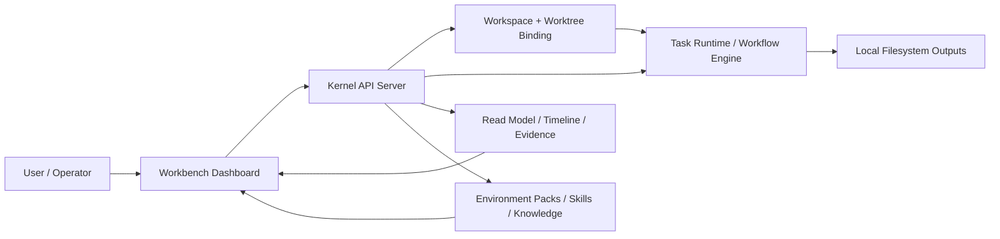

# Tik Baseline

> 更新日期：2026-04-15
> 口径：只记录已经在仓库中落地、并已被本轮联调/回归验证过的能力；不把“规划中能力”写成“已完成能力”。

## 1. 当前产品基线

Tik 现在已经不是一个只有 runtime 和 engine 的底层实验仓库，它已经形成了一个可运行的单工作区个人工作台：

- 你主要在 Dashboard/Workbench 上发起任务、看任务状态、补充 note、查看产物、做 acceptance。
- agent 负责在当前工作区里执行任务，用户更多扮演决策者、审阅者和约束输入者。
- 任务默认绑定当前 workspace，并继承所选 environment pack、skills、knowledge 等执行上下文。
- UI 已经从“静态任务详情页”演进为“控制台式工作台”，强调 queue、focus、live run、artifact review、setup 调整。

这意味着 Tik 当前的真实定位是：

> 一个以本地 workspace 为运行边界、以任务工作台为主交互面的 agent control console。

## 2. 当前默认入口

当前有三条默认入口，它们已经能组成一套闭环：

1. CLI / runtime / workflow 能力：
   `packages/cli`、`packages/kernel`、`packages/shared`
2. 本地 API 服务：
   `packages/kernel/src/server.ts`
3. 控制台式 Web 工作台：
   `packages/dashboard`

用户最直观的入口已经是 Dashboard，而不是只通过 CLI 直接操作底层 runtime。

## 3. 架构基线

当前基线里的关键事实：

- Dashboard 不是 mock，它已经连接到了 kernel workbench API。
- 任务状态、timeline、decision、configuration、artifact preview 都有真实接口支撑。
- workspace 绑定是本地路径模型，不是远程托管项目模型。
- live run 目前是“timeline 事件流的控制台化展示”，不是 raw stdout byte stream。

## 4. 已落地核心能力

### 4.1 任务运行时与工作区绑定

当前任务模型已经具备明确的 workspace 绑定能力，任务会记录：

- `workspaceRoot`
- `workspaceName`
- `workspaceFile`
- `projectName`
- `sourceProjectPath`
- `effectiveProjectPath`
- `laneId`
- `worktreeKind`
- `worktreePath`

这意味着当前系统已经支持：

- 任务知道自己属于哪个 workspace/project
- 任务可以绑定 source project 与 effective project
- 任务可以落到默认目录或 worktree lane
- 新任务能够继承当前聚焦任务的 workspace/setup

对应的类型定义已经在：

- `packages/shared/src/types/task.ts`
- `packages/shared/src/types/workspace.ts`

### 4.2 控制台式 Workbench

Dashboard 里的 Workbench 已经形成了比较完整的单工作区操作面：

- 左侧是任务队列与视图切换
- 中间是当前聚焦任务的执行与对话控制区
- 右侧是 output / artifact / setup / environment / skills 等工作台辅助面板

当前任务视图已包含这些主通道：

- `Inbox`
- `Today`
- `All`
- `Completed`
- `Archived`

任务卡当前会展示的关键信息包括：

- 任务标题 / 任务编号
- 当前状态
- artifact readiness
- environment pack
- touched files / output 摘要
- `Open` / preview / acceptance 导航入口

这部分已经不是静态展示，而是和真实 task read model 联动。

### 4.3 New Task 闭环

`New task` 已经具备真实的任务创建链路，而不是只弹一个样式化 modal：

- 创建任务时会绑定当前 workspace
- 会选择或继承 environment pack
- 会带入任务标题、目标描述、初始 setup
- 创建完成后会写入 workbench task 列表并进入后续运行/验收链路

当前基线下，`new task` 的语义不是“只建一个卡片”，而是“在当前工作区中启动一条可运行、可调整、可验收的任务记录”。

### 4.4 Universal Composer

Universal Composer 已经不是单纯输入框，而是一个多意图入口。当前已经落地的能力包括：

- `#new` / 自然语言发起新任务
- `#note` 为当前任务追加操作 note
- `@TASK #note` 定向给指定任务补充 note
- `#approve` / `#reject` 处理 decision 类输入

它当前的真实职责是：

- 统一接收“新任务 / note / 决策”三类输入
- 将输入路由到对应的 task API
- 在成功后刷新 workbench read model，让 queue、focus、timeline、acceptance 一起更新

### 4.5 Task Note / Mission Steering

任务对话框现在的重点不是“聊天”，而是“调任务执行过程”。

也就是说，用户在 focus pane 中输入的内容，本质上是：

- 补充约束
- 校正目标
- 批准 / 拒绝方向
- 请求重跑
- 改变可用 setup

当前系统对 note 的处理已经形成明确语义：

- 运行中的任务：追加 guidance，推动后续 pass 继续执行
- 等待中的任务：作为 resume / constraint 输入重新进入执行链路
- decision 状态任务：把 note 和 approve/reject 一起转成可执行的后续动作
- 终态任务：允许基于新 guidance 触发 follow-up / retry

这部分的核心目标已经明确：

> 对话不是记录聊天，而是操纵任务。

### 4.6 任务头部控制区

任务头部已经从几个松散按钮，整理成三个明确控制分组：

1. `Run / Execution lane`
   - `Run next pass`
   - `Hide from queue`
   - preview artifact
   - jump to acceptance
2. `Configure / Runtime inputs`
   - `Tools, skills, knowledge`
   - 滚动到当前任务 setup 配置区
3. `Guide / Brief and guidance`
   - 调整任务标题
   - 调整 brief / adjustment note
   - `Save guidance`
   - `Reset`
   - `Revert last guidance`

这说明当前工作台的主心骨已经是：

- 运行
- 配置
- 引导

而不再是“信息浏览页 + 一点按钮”。

### 4.7 Live Run Log

右侧 output rail 里已经有一个 CLI 风格的 `Live run log` 模块。

它当前已具备：

- 显示当前运行状态
- 显示 `CURRENT LINE`
- 自动滚动最近 supervisor / operator / tool / decision 事件
- 在空状态下给出明确的 idle 提示

但要特别说明当前真实边界：

- 它是从 task timeline/read model 派生出来的事件式 run log
- 它不是进程级 raw stdout/stderr 直通
- 更像“控制台化执行轨迹”，而不是“字节流终端镜像”

这是当前产品已经可用、但仍需继续增强的地方。

### 4.8 Artifact / Acceptance Surface

当前工作台里，任务不再只停在“状态完成”，而是已经有独立的验收面：

- artifact preview
- touched files 摘要
- latest output / error excerpt
- tool events
- acceptance 区域定位

这意味着“Done” 不再只是一个 badge，用户已经可以沿着以下路径做 review：

1. 看 queue 中任务状态
2. `Open` 进入 focus
3. 看 live run / output rail
4. 预览 artifact
5. 查看 touched files / output 摘要
6. 决定接受、补 note、或重跑

### 4.9 Execution Setup

任务右侧已经有可操作的 execution setup 模块，当前支持：

- environment pack picker
- selected skills 列表
- selected knowledge 列表
- save setup
- reset to defaults

当前的真实语义是：

- 改的是“当前任务可用的执行配置”
- 不是直接修改全局 pack 定义本身
- 任务 setup 可以被后续 pass 消费

### 4.10 Environment 模块

Environment 模块已经单独成型，不再只是任务表单中的一个下拉框。

当前可见能力包括：

- environment packs 列表
- active pack
- dashboard summaries
- promotion queue
- latest bound tasks
- mounted namespaces

对应的 API 已经存在：

- `/api/environment-packs`
- `/api/environment-packs/dashboard`
- `/api/environment-packs/active`

它的真实作用是：

- 让用户看到“这个工作区现在有哪些执行环境包可用”
- 看到哪些任务正在绑定某个 pack
- 形成从“环境资产”到“任务执行”的观察链路

### 4.11 Skills 模块

Skills 已经从“概念字段”进化为独立模块，当前具备这些能力：

- skill manifest registry
- draft / publish
- shared 与 environment-scoped manifests
- 任务选择 skill
- skill draft notes

当前 skills 模块的作用不是“技能市场”，而是：

- 为任务提供可选执行能力清单
- 支持草稿态 skill 配置
- 支持在任务运行前/运行中调整可用 skill 集合

### 4.12 Workflow / Read Model / Evidence

早期 baseline 中强调的 workflow engine、read path、context/contract/evidence 仍然存在，而且现在已经被 workbench 真正消费：

- task list 是 read model 投影
- timeline 是 live run / history / decision 的数据来源
- artifact / output / touched files 是 evidence 面的一部分
- configuration / brief / archive / retry 都通过 workbench API 操作 runtime state

也就是说，底层 engine 没有被丢掉，而是被真正产品化到了 workbench UI 中。

## 5. 当前用户可观察行为

从用户视角，现在这套产品已经能完成下面这条主链路：

1. 进入工作台
2. 在当前 workspace 中创建任务
3. 给任务配置 environment / skills / knowledge
4. 观察 agent 运行状态和 live run 事件
5. 在任务执行中补 note / guidance
6. 让任务进入下一轮 pass 或 retry
7. 查看 artifact / output / touched files
8. 做 acceptance 或 archive

对“加 note 之后会发生什么”的当前真值可以明确写成：

- note 会写入当前任务 brief/guidance 更新链路
- 如果当前 task 支持 follow-up，它会触发下一轮 pass
- queue / focus / timeline / live run 会随之刷新
- 如果任务处于等待/决策态，note 会作为 resume 或 steering 输入进入后续执行

这部分已经不是规划，而是当前产品行为。

## 6. 当前 API 基线

Workbench 相关的主接口已经成型，当前基线至少包括：

- `POST /api/workbench/tasks`
- `GET /api/workbench/tasks`
- `GET /api/workbench/tasks/:id/timeline`
- `GET /api/workbench/tasks/:id/decisions`
- `POST /api/workbench/tasks/:id/retry`
- `POST /api/workbench/tasks/:id/archive`
- `POST /api/workbench/tasks/:id/brief`
- `GET /api/workbench/tasks/:id/configuration`

配套还有：

- artifact preview / output 读取能力
- workspace / worktree 相关 API
- environment packs API
- skills registry 相关 API

这说明 Dashboard 当前是建立在真实 API 之上的，而不是完全前端内存态。

## 7. 关键实现位置

当前基线中最关键的实现区域如下：

- Dashboard 主入口：
  `packages/dashboard/src/App.tsx`
- Workbench 任务头部与控制面：
  `packages/dashboard/src/components/WorkbenchTaskHeader.tsx`
- Workbench 任务列表：
  `packages/dashboard/src/components/WorkbenchTaskList.tsx`
- Universal Composer：
  `packages/dashboard/src/components/WorkbenchComposer.tsx`
- Output rail / live run / acceptance：
  `packages/dashboard/src/components/WorkbenchOutputRail.tsx`
- Environment 模块：
  `packages/dashboard/src/components/WorkbenchEnvironmentView.tsx`
- Skills 模块：
  `packages/dashboard/src/components/WorkbenchSkillsView.tsx`
- Workbench view models：
  `packages/dashboard/src/view-models/workbench.ts`
  `packages/dashboard/src/view-models/composer.ts`
  `packages/dashboard/src/view-models/environment.ts`
  `packages/dashboard/src/view-models/skills.ts`
- Kernel workbench API：
  `packages/kernel/src/server.ts`
- Workbench service / store：
  `packages/kernel/src/workbench/workbench-service.ts`
  `packages/kernel/src/workbench/workbench-store.ts`
- 共享 task / workspace 类型：
  `packages/shared/src/types/task.ts`
  `packages/shared/src/types/workspace.ts`

## 8. 已完成验证

本轮已经完成、并能支撑这份 baseline 的验证包括：

### 8.1 Dashboard 单测与构建

- `pnpm --dir /Users/huyuehui/ace/tik --filter @tik/dashboard test -- composer.test.ts workbench.test.ts client.test.ts skills.test.ts environment.test.ts`
  - 48/48 通过
- `pnpm --dir /Users/huyuehui/ace/tik --filter @tik/dashboard build`
  - 已通过

### 8.2 Kernel / Workbench API

- workbench note / retry / configuration 相关 API 已联通
- server workbench API 测试在此前修复后通过
- note -> brief update -> next pass 这条链路已做过真实浏览器回归

### 8.3 浏览器联调

已经实际验证过这些行为：

- `Live run log` 在页面中真实渲染
- header 控制区显示 `Run / Configure / Guide` 三组语义
- Universal Composer 提交 note 时会触发真实 API 请求
- note 成功后会出现“已应用 guidance / next pass 已启动”类反馈
- `new task` 会继承 workspace / setup，而不是生成纯前端假卡片

## 9. 当前限制

当前基线也有明确边界，不能写得过满：

### 9.1 仍然是单工作区优先

当前真正做实的是：

- 单工作区个人工作台
- 本地 workspace/path 绑定
- 本地 task runtime + local read model

还没有做成：

- 多工作区统一调度中心
- 多 agent 托管控制平面
- 远程项目池 / 远程运行器编排

### 9.2 远程 kit 项目关联不是一等能力

目前支持的是：

- 任务绑定本地 workspace/project/path
- 通过本地 clone / mount 后纳入 workspace

目前还不支持：

- 直接把“远程 kit 项目”作为一等资源接进当前产品
- 远程托管仓库与本地工作台之间的完整 project association 模型

所以如果要“关联远程 kit 项目”，当前真实方案仍然是先把项目落到本地 workspace，再走现有绑定链路。

### 9.3 Live run 不是 raw terminal streaming

虽然现在已经有 CLI 风格输出区，但它本质上还是：

- timeline-derived
- event-based
- read-model friendly

而不是：

- PTY 级字节流
- 任意进程 stdout/stderr 透传

### 9.4 Environment / Skills 仍以任务消费为主

现在已经能：

- 看 pack / skill
- 选 pack / skill
- 保存任务 setup
- draft / publish manifest

但还没有完全做成：

- 完整的 pack 生命周期管理台
- 复杂权限/版本治理
- 多环境 promotion 编排中心

### 9.5 历史任务与长期运营能力仍偏轻

已有：

- completed / archived 视图
- archive 行为

还偏弱：

- 大规模历史任务检索
- 长周期运营统计
- 自动清理 / compaction / retention 策略

## 10. 当前结论

截至 2026-04-15，Tik 的真实基线可以明确表述为：

> Tik 已经具备一个可运行的单工作区 agent 工作台产品雏形，而且关键闭环已经成立：创建任务、绑定 workspace、配置 environment/skills、执行、补 note、查看 live run、查看产物、做 acceptance。

它当前已经不是“只有底层引擎，没有产品面”的状态；
但它也还不是“多工作区、多 agent、远程托管”的完整 control plane。

如果继续沿当前方向演进，下一阶段最自然的增量不是重做基础运行时，而是继续补齐：

1. 更强的 live execution observability
2. 更完整的 artifact / acceptance 体系
3. 更成熟的 environment/skills 生命周期管理
4. 多工作区 / 远程 project association
5. 更强的历史任务检索与运营能力

这就是当前仓库应该对外、也应该对自己承认的真实 baseline。
